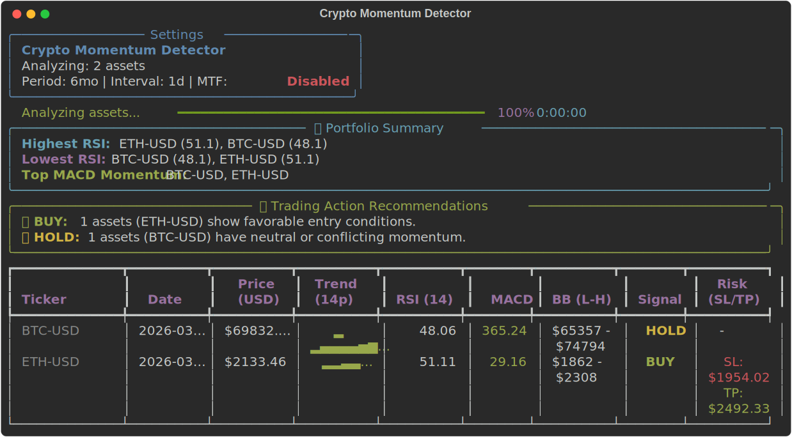
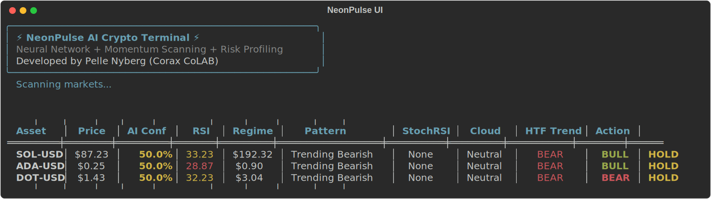
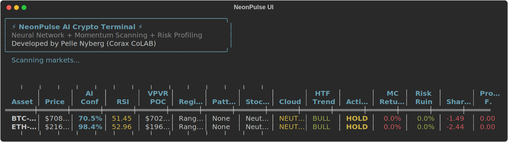
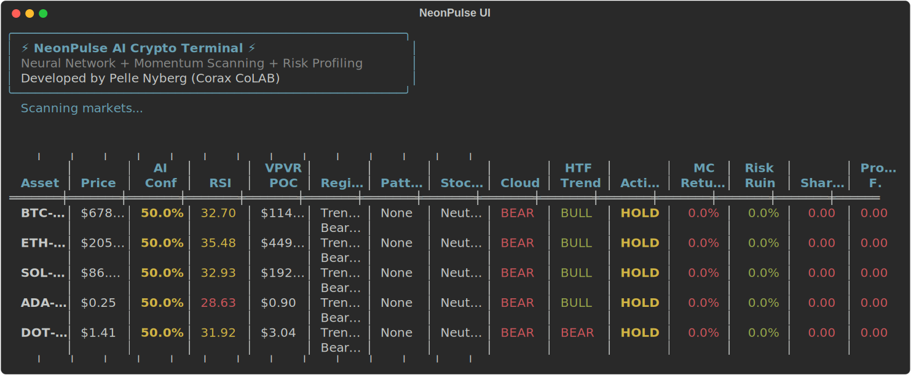

<div align="center">

#  Crypto Momentum Detector 

<br/>

[](https://www.python.org/downloads/)
[](https://opensource.org/licenses/MIT)
[](https://github.com/psf/black)
[]()
[](https://github.com/PelleNybe)

[](https://github.com/PelleNybe/crypto-momentum-detector/actions)
[](https://github.com/PelleNybe/crypto-momentum-detector/network/members)
[](https://github.com/PelleNybe/crypto-momentum-detector/stargazers)
[](https://github.com/PelleNybe/crypto-momentum-detector/watchers)
[](https://github.com/PelleNybe/crypto-momentum-detector/issues)
[](http://makeapullrequest.com)

<br/>
<br/>


<br/>

<h2><b>⚡ A powerful, blazing-fast CLI tool to analyze cryptocurrency momentum, calculate technical indicators, and generate actionable trading signals! ⚡</b></h2>

<br/>


</div>

<br/>
<br/>

## 🌟 Discover the Future of Trading Analysis

Welcome to the **Crypto Momentum Detector**. Built for traders, developers, and crypto enthusiasts who demand **speed**, **precision**, and **beautiful aesthetics** in their terminal.

Whether you're a day trader hunting for quick setups or an investor looking for macro trend confirmations, this tool equips you with the heavy-lifting technical analysis so you can focus on executing winning strategies.

---

## 🚀 Key Features

*   **📊 Historic & Real-Time Data**: Harness the power of `yfinance` to pull Open, High, Low, Close, and Volume data for *any* supported cryptocurrency pair (e.g., BTC-USD, ETH-USD, SOL-USD).
*   **⚡ Blazing Fast Concurrency**: Say goodbye to waiting. We use Python's `ThreadPoolExecutor` to analyze multiple tickers simultaneously.
*   **🧠 Advanced Technical Indicators**: Powered by the robust `ta` library, it calculates:
    *   **RSI** (Relative Strength Index) - 14 periods
    *   **MACD** (Moving Average Convergence Divergence)
    *   **SMA & EMA** (Simple and Exponential Moving Averages) - 20 & 50 periods
    *   **ATR** (Average True Range) - 14 periods
    *   **Bollinger Bands**
*   **🎯 Intelligent Signal Generation**: Get clear, un-biased trading recommendations: `BUY`, `SELL`, `HOLD`, `STRONG BUY`, and `STRONG SELL`.
*   **🛡️ Dynamic Risk Management**: Never trade without a plan. Our engine automatically calculates ATR-based **Stop Loss (SL)** and **Take Profit (TP)** levels for every actionable setup.
*   **🗺️ Multi-Timeframe (MTF) Analysis**: Enable this feature to validate short-term signals against macro trends. Don't trade against the big guys!
*   **⏪ Backtesting Engine**: Test your theories before risking capital. Run simulations over historical data with customizable RSI thresholds and see detailed performance metrics (Win Rate, Max Drawdown, Return).
*   **💾 Smart Parquet Caching**: Ultra-fast local caching using `pyarrow`/`fastparquet` to eliminate redundant API calls and prevent rate-limiting.
*   **🎨 Stunning CLI Output**: Powered by `rich`, experience a terminal like never before with progress bars, color-coded tables, sparkline charts, and portfolio summaries.
*   **📝 Export & Integrate**: Export all momentum analysis, risk metrics, and signals to a clean `.csv` file for external spreadsheet analysis or bot integration.

---

<div align="center">
  
</div>

<br/>

## 📸 System In Action

<div align="center">
  <p><i>Experience the beautifully crafted terminal interface built with <code>rich</code>.</i></p>

  <h3>1. Default Analysis</h3>
  

  <br><br>

  <h3>2. Multi-Timeframe (MTF) Analysis</h3>
  

  <br><br>

  <h3>3. Strategy Backtesting</h3>
  

  <br><br>

  <h3>4. Portfolio Overview</h3>
  
</div>

<br/>

<div align="center">
  
</div>

## 🛠️ Installation

Get up and running in less than 2 minutes! Ensure you have **Python 3.8+** installed.

1.  **Clone the repository:**
    ```bash
    git clone https://github.com/PelleNybe/crypto-momentum-detector.git
    cd crypto-momentum-detector
    ```

2.  **Install the required dependencies:**
    ```bash
    pip install -r requirements.txt
    ```

*(Optional but recommended): Install caching engines for 10x faster subsequent runs:*
```bash
pip install pyarrow fastparquet
```

---

## 💻 Usage & Commands

Run the CLI tool using `main.py`. The tool is highly flexible and parameter-driven.

### 🟢 Quick Start (The Default Run)
Analyze the default tickers (BTC-USD, ETH-USD) with default settings (6 months period, 1 day interval):
```bash
python main.py
```

### 🟠 Advanced Power User
Specify your own basket of altcoins, set the timeframe, export the results to a CSV, and utilize MTF analysis for maximum accuracy:
```bash
python main.py --tickers SOL-USD ADA-USD DOT-USD --period 1y --interval 1wk --use-mtf --export signals.csv
```

### 🟣 Strategy Backtesting
Want to know if your strategy actually works? Run a historical backtest and see detailed performance metrics:
```bash
python main.py --backtest --period 1y --tickers BTC-USD
```

---

## ⚙️ Configuration Glossary

<details>
<summary><b>🔥 Click to reveal all available CLI arguments 🔥</b></summary>
<br>

| Argument | Description | Example |
| :--- | :--- | :--- |
| `--tickers` | Space-separated list of cryptocurrency symbols | `--tickers BTC-USD XRP-USD SOL-USD` |
| `--period` | Historical data period to fetch (`1mo`, `3mo`, `6mo`, `1y`, `max`) | `--period 1y` |
| `--interval` | Timeframe interval between data points (`1h`, `1d`, `1wk`) | `--interval 1d` |
| `--export` | File path to export the detailed results as a CSV | `--export my_trades.csv` |
| `--backtest` | Flag to run a historical backtest and display performance | `--backtest` |
| `--use-mtf` | Flag to enable Multi-Timeframe analysis to confirm macro trends | `--use-mtf` |

</details>

<br/>

## 🧠 Behind the Scenes: Strategy Logic

<details>
<summary><b>📈 Click to dive into the trading engine logic 📉</b></summary>
<br>

*   **📈 Bullish / Buy Setup**:
    *   RSI is rising (between default 40-70).
    *   MACD is above its signal line (momentum shift).
    *   Closing price is above the 20 EMA (short-term uptrend).
    *   *(If `--use-mtf` is active)*: The higher timeframe trend is also definitively bullish.
*   **📉 Bearish / Sell Setup**:
    *   RSI is falling (between default 30-60).
    *   MACD is below its signal line.
    *   Closing price is below the 20 EMA.
    *   *(If `--use-mtf` is active)*: The higher timeframe trend is bearish.
*   **💥 Extreme Signals (Strong Buy / Sell)**: Extreme overbought (RSI > 70) or oversold (RSI < 30) conditions combined with sharp MACD reversals.
*   **🛡️ Dynamic Risk Calculation**: Take Profit (TP) and Stop Loss (SL) levels aren't guessed. They are mathematically scaled based on the **Average True Range (ATR)** relative to the current closing price, providing a volatility-adjusted dynamic risk profile for every generated setup.

</details>

---

## 🧪 Testing and Reliability

We believe in robust code. This project uses `pytest` for unit testing, including mocked API responses to ensure the logic remains sound without hitting external rate limits.

```bash
# Run the test suite
python -m pytest tests/
```

---

<br/>

<div align="center">
  
</div>

## 👨‍💻 Meet the Developer & The Company

<div align="center">

### **Pelle Nyberg**
*Visionary Software Engineer & Quantitative Developer*

[](https://github.com/PelleNybe)
[](https://www.linkedin.com/in/pellenyberg/)
[](https://pellenybe.github.io)
[](https://cryptop.coraxcolab.com)

With a deep passion for financial markets, algorithmic trading, and cutting-edge software architecture, Pelle bridges the gap between complex quantitative analysis and beautifully engineered, user-centric tools.

<br/>
<br/>


### **Corax CoLAB**
*Innovating the Future of Digital Solutions*

[](https://coraxcolab.com)

At **Corax CoLAB**, we build scalable, high-performance software solutions. From robust trading algorithms and data pipelines to full-stack web applications, Corax CoLAB is dedicated to pushing the boundaries of what technology can achieve. Visit us to see how we are shaping the future.

</div>

<div align="center">
  
</div>

## 📜 License

This project is open-sourced software licensed under the **[MIT License](LICENSE)**.

<br/>

<div align="center">
  <i>"In trading, vision is everything. In development, execution is everything."</i><br/>
  <b>Made with  by Pelle Nyberg @ Corax CoLAB</b>
</div>
