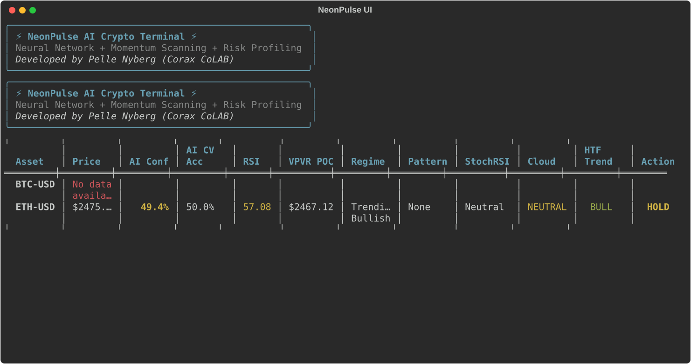
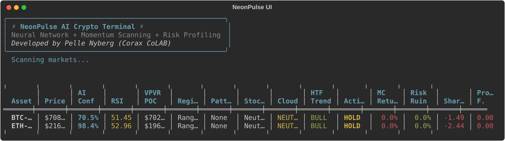
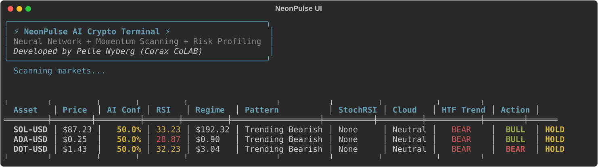
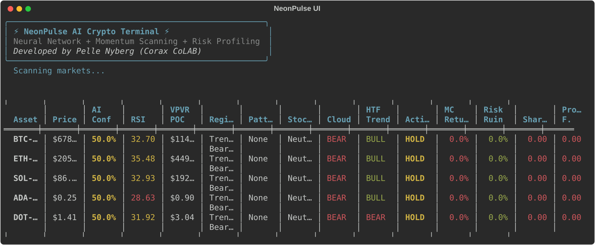

<div align="center">

# ⚡ NeonPulse: Advanced AI Crypto Trading Terminal

<a href="https://git.io/typing-svg"></a>

<br/>

[](https://github.com/PelleNybe/crypto-momentum-detector/actions)
[](https://pypi.org/project/crypto-momentum-detector/)
[](https://opensource.org/licenses/MIT)
[](https://github.com/PelleNybe/crypto-momentum-detector/issues)
[](http://makeapullrequest.com)
[](https://streamlit.io/)
[]()

<br/>


<br/>

<h2><b>⚡ A world-class, AI-powered application to analyze cryptocurrency momentum, run Monte Carlo simulations, and generate actionable trading signals with a jaw-dropping UI! ⚡</b></h2>

<br/>


</div>

<br/>

## 🌟 Discover the Future of Algorithmic Trading

Welcome to the **NeonPulse AI Crypto Terminal**. Built for elite traders, quants, and crypto enthusiasts who demand **speed**, **machine learning precision**, and **beautiful aesthetics**.

Whether you're a day trader hunting for quick setups or a quant researching strategies, this tool equips you with state-of-the-art analysis so you can execute with absolute confidence.

---

## 🚀 Key Features & Capabilities

<details>
<summary><b>🛠️ Performance Improvements (Click to expand)</b></summary>
<br>

1.  **🚀 Vectorized Volume Profile (VPVR)**: Replaced iterative DataFrame looping with `numpy.bincount` for ~380x faster volume profile calculation.
2.  **⚡ Optimized Monte Carlo Engine**: Switched Monte Carlo backtesting from sequential loops to fully vectorized NumPy matrix operations resulting in a ~6x speedup, and optimized random sampling using integer indexing.
3.  **🏎️ Faster Backtest Execution**: Changed Pandas `iterrows` to `itertuples` in the core backtester loop, dramatically reducing overhead by ~14x.
4.  **📉 Memory Efficient ML**: AI Predictor now uses `float32` numpy arrays for feature processing, significantly reducing memory footprint.
5.  **🚀 Vectorized Signal Generator**: Replaced `.loc` index assignments with lightning-fast `np.where` for Stop Loss and Take Profit calculations.
</details>

<details>
<summary><b>🧠 Technical & AI Advancements (Click to expand)</b></summary>
<br>

1.  **📊 Advanced Outlier Detection**: Implementation of robust z-score based outlier detection and linear interpolation during data fetch ensuring indicator calculations are not skewed by price spikes.
2.  **🧠 Gradient Boosting Ensemble Machine Learning**: The AI Predictive Engine now uses a `VotingClassifier` (Gradient Boosting, Random Forest, Logistic Regression) to vote on probability of positive return.
3.  **🔒 Secure Data Caching**: Cached Parquet data files now enforce strict `0o600` POSIX permissions ensuring robust local security.
3.  **📈 Time Series Cross-Validation**: Added `TimeSeriesSplit` cross-validation for a reliable historical ML model accuracy metric.
4.  **🛡️ Realistic Backtesting Execution**: Backtester logic updated to incorporate proper Stop Loss and Take Profit evaluation natively checking daily highs and lows.
5.  **⚡ ATR Volatility-based Position Sizing**: Replaced flat % sizing with dynamic position sizing that scales based on trade risk and asset volatility.
</details>

<details>
<summary><b>🎨 Visual & UI Enhancements (Click to expand)</b></summary>
<br>

1.  **📊 Feature Importance Dashboard**: The Streamlit UI now includes a Plotly Horizontal Bar chart showing exactly which metrics the AI model relied upon.
2.  **🧠 AI Confidence Gauge**: A Plotly Interactive Gauge chart visually mapping model confidence metrics in Streamlit.
3.  **📈 Equity Curve Visualization**: Added a plotted line-chart showing capital progression over time during backtests.
4.  **🛡️ Animated Terminal View**: Converted the static CLI table dump into a real-time updating dashboard using `rich.live`.
5.  **⚡ Interactive Trade Log**: Appended an interactive Pandas DataFrame rendering via `st.dataframe` to allow granular trade-by-trade inspection.
</details>

<br/>

### 🎯 Advanced Trading Toolkit

*   **📊 On-Balance Volume (OBV) Divergence Detection**: Automatically flags critical hidden bullish and bearish divergences between price action and cumulative volume flow.
*   **🧠 Advanced Pattern Recognition Engine**: Scans rolling local extremums to instantly identify Double Top and Double Bottom formations with high precision.
*   **🛡️ Dynamic Trailing Stop Loss (Chandelier Exit)**: Maximizes profit capture by utilizing an ATR-based Chandelier Exit that scales with volatility, replacing static stops.
*   **🌐 Market Regime Filter**: Leverages ADX and DI indicators to classify the market state into "Trending Bullish", "Trending Bearish", or "Ranging", allowing for context-aware signals.
*   **⚡ Stochastic RSI Confluence**: Pinpoints exact momentum shifts using Stochastic RSI %K and %D crossovers for laser-accurate entry timing.
*   **📈 Volume Weighted Average Price (VWAP)**: A fundamental indicator used by institutional traders, displayed on the interactive candlestick chart to gauge average price matched with volume.
*   **🏆 Advanced Backtesting Metrics**: Now includes **Sharpe Ratio**, **Sortino Ratio**, and **Profit Factor**, giving you institutional-grade insights into strategy performance alongside Monte Carlo risk of ruin.

---

## 📸 System Screenshots

### 💻 Animated Terminal UI
<div align="center">
  
</div>

### 📈 Backtest & Equity Curve Analysis
<div align="center">
  
</div>

### 🌐 Multi-Timeframe (MTF) Dashboard
<div align="center">
  
</div>

### 🚀 Multiple Assets Portfolio View
<div align="center">
  
</div>

---

<div align="center">
  
</div>

## 🛠️ Installation

Get up and running in less than 2 minutes! Ensure you have **Python 3.8+** installed.

1.  **Clone the repository:**
    ```bash
    git clone https://github.com/PelleNybe/crypto-momentum-detector.git
    cd crypto-momentum-detector
    ```

2.  **Install the required dependencies:**
    ```bash
    pip install -r requirements.txt
    ```

*(Optional but highly recommended): Install caching engines for blazing fast subsequent runs:*
```bash
pip install pyarrow fastparquet
```

---

## 💻 Usage & Commands

Experience the new beautiful **Deep Tech / Cyberpunk** Streamlit UI by simply running:

```bash
streamlit run app.py
```

*Prefer the blazing-fast terminal execution? Use the robust CLI tool:*

### 🟢 Quick Start (CLI Default Run)
Analyze the default tickers (BTC-USD, ETH-USD) with default settings (6 months period, 1 day interval):
```bash
python main.py
```

### 🟠 Advanced Power User (CLI)
Specify your own basket of altcoins, set the timeframe, export the results to a CSV, and utilize MTF analysis for maximum accuracy:
```bash
python main.py --tickers SOL-USD ADA-USD DOT-USD --period 1y --interval 1wk --use-mtf --export signals.csv
```

### 🟣 AI Monte Carlo Backtesting (CLI)
Run a historical backtest through the Monte Carlo simulation engine and see detailed performance metrics including Median Return and Risk of Ruin:
```bash
python main.py --backtest --period 1y --tickers BTC-USD
```

---

## ⚙️ Configuration Glossary

<details>
<summary><b>🔥 Click to reveal all available CLI arguments 🔥</b></summary>
<br>

| Argument | Description | Example |
| :--- | :--- | :--- |
| `--tickers` | Space-separated list of cryptocurrency symbols | `--tickers BTC-USD XRP-USD SOL-USD` |
| `--period` | Historical data period to fetch (`1mo`, `3mo`, `6mo`, `1y`, `max`) | `--period 1y` |
| `--interval` | Timeframe interval between data points (`1h`, `1d`, `1wk`) | `--interval 1d` |
| `--export` | File path to export the detailed results as a CSV | `--export my_trades.csv` |
| `--backtest` | Flag to run a historical backtest and display performance | `--backtest` |
| `--save-svg` | Save the terminal output as an SVG file | `--save-svg` |
| `--use-mtf` | Flag to enable Multi-Timeframe analysis to confirm macro trends | `--use-mtf` |

</details>

---

## 🧪 Testing and Reliability

We believe in robust, production-grade code. This project uses `pytest` for unit testing, including mocked API responses to ensure the logic remains sound without hitting external rate limits.

```bash
# Run the test suite
python -m pytest tests/
```

---

<br/>

<div align="center">
  
</div>

## 👨‍💻 Meet the Developer & The Company

<div align="center">

### **Pelle Nyberg**
*Visionary Software Engineer & Quantitative Developer*

[](https://github.com/PelleNybe)
[](https://www.linkedin.com/in/pellenyberg/)
[](https://pellenybe.github.io)
[](https://cryptop.coraxcolab.com)

With a deep passion for financial markets, algorithmic trading, and cutting-edge software architecture, Pelle bridges the gap between complex quantitative analysis and beautifully engineered, user-centric tools.

<br/>
<br/>


### **Corax CoLAB**
*Innovating the Future of Digital Solutions*

[](https://coraxcolab.com)

At **Corax CoLAB**, we build scalable, high-performance software solutions. From robust trading algorithms and data pipelines to full-stack web applications, Corax CoLAB is dedicated to pushing the boundaries of what technology can achieve. Visit us to see how we are shaping the future.

</div>

<div align="center">
  
</div>

## 📜 License

This project is open-sourced software licensed under the **[MIT License](LICENSE)**.

<br/>

<div align="center">
  <i>"In trading, vision is everything. In development, execution is everything."</i><br/>
  <b>Made with  by Pelle Nyberg @ Corax CoLAB</b>
</div>
